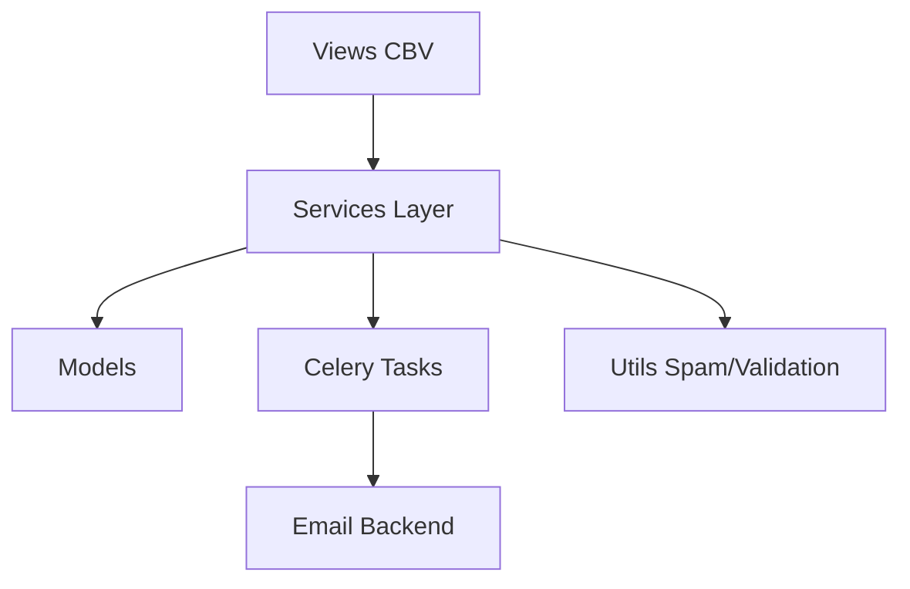

# Contact App Architecture

## Overview
Contact app uses a layered architecture with clear separation of concerns.

## 🏗️ Architecture Layers



## 📊 Data Flow

```
User Form Submission
    ↓
ContactView (validation)
    ↓
ContactService.process_submission()
    ↓
├─→ Save to ContactSubmission model
├─→ Queue email task (Celery)
└─→ Return result
    ↓
Celery Worker → Send Email
```

## 🗂️ Directory Structure

```
apps/contact/
├── models.py          # Data models
├── views.py           # Class-based views
├── forms.py           # Django forms
├── services.py        # Business logic
├── tasks.py           # Celery tasks
├── utils/             # Helper functions
│   ├── spam_detector.py
│   ├── validators.py
│   └── ...
├── tests/             # Test files (12+)
├── templates/         # HTML templates
└── static/            # CSS, JS
```

## 🔐 Security Architecture

```
Request → CSRF Check → Form Validation → Spam Detection → Save
                                                ↓
                                         Rate Limit (P2)
                                                ↓
                                         Email Notification
```

## ⚡ Performance Architecture

- **Async Tasks:** Celery for email sending
- **Caching:** RTI officer query caching
- **Indexing:** Database indexes on key fields
- **Auto-save:** localStorage for form persistence

## 🌐 Integration Points

- Email backend (SMTP)
- Celery/Redis
- Google Maps API
- Staff/Team app (for RTI officer)

---

**Version:** 2.0.0  
**Last Updated:** January 6, 2026
