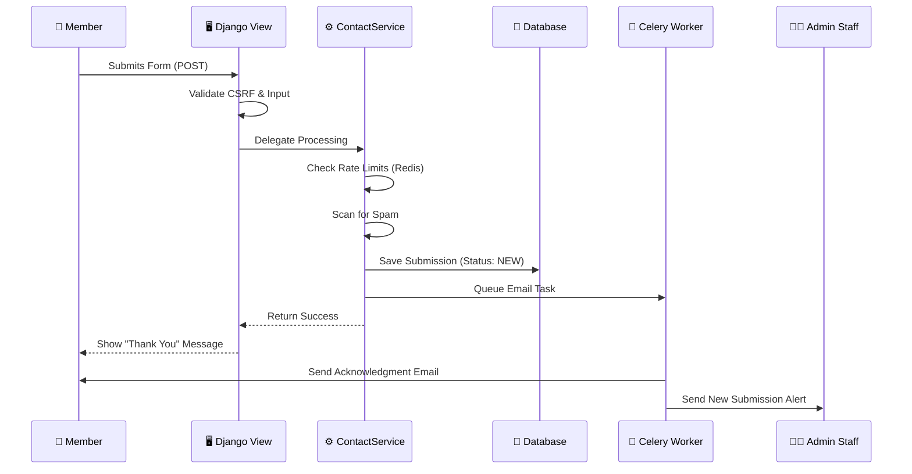
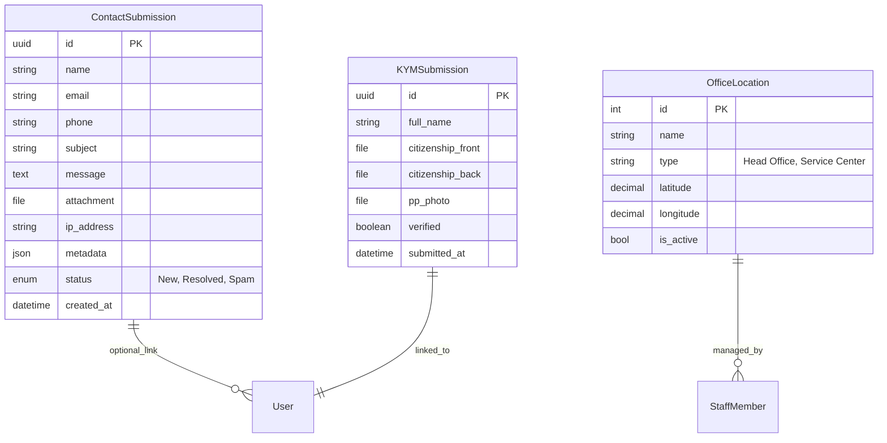

# Contact & Messaging System
*(Bhanjyang Cooperative Society Ltd.)*

[]()
[]()
[]()
[]()
[]()
[]()

**A comprehensive, enterprise-grade communication module designed to handle high-volume member interactions, compliance mandates, and automated workflows.**

---

## 📑 Table of Contents (विषयसूची)

1.  [🇳🇵 नेपाली विवरण (Nepali Overview)](#-नेपाली-विवरण-nepali-overview)
2.  [✨ Core Capabilities](#-core-capabilities)
3.  [🏗️ System Architecture](#-system-architecture)
4.  [💾 Database Schema (ERD)](#-database-schema-erd)
5.  [📂 Project Structure](#-project-structure)
6.  [⚙️ Configuration & Environment](#-configuration--environment)
7.  [🛡️ Security Protocol](#-security-protocol)
8.  [🔌 API Reference](#-api-reference-planned)
9.  [👨‍💻 Developer Guide](#-developer-guide)
10. [🔧 Troubleshooting](#-troubleshooting)

---

## 🇳🇵 नेपाली विवरण (Nepali Overview)

**भञ्ज्याङ सहकारी सम्पर्क प्रणाली** संस्था र सदस्यहरू बीचको डिजिटल पुल हो। यसले साधारण सोधपुछ देखि अति संवेदनशील कागजात (KYM) बुझाउने कार्यलाई सुरक्षित र व्यवस्थित बनाउँछ।

### 🌟 मुख्य सुविधाहरू
*   **सम्पर्क फारम (Contact Form):** 
    *   नेपाली र अंग्रेजी दुवै भाषामा उपलब्ध।
    *   सन्देश पठाउँदा फाइल (फोटो, डकुमेन्ट) पनि पठाउन मिल्ने।
    *   फारम भर्दाभर्दै बन्द भएमा पुन: खोल्दा त्यहीँबाट सुरु हुने (Auto-save)।
*   **डिजिटल के.वाई.एम (Digital KYM):** 
    *   नयाँ सदस्य बन्न वा विवरण अद्यावधिक गर्न अनलाइन फारम।
    *   नागरिकता, फोटो, र हस्ताक्षर सुरक्षित रूपमा अपलोड गर्न मिल्ने।
*   **सूचनाको हक (RTI):** 
    *   नेपालको संविधान र सूचनाको हक ऐन २०६४ बमोजिम सूचना अधिकारीको विवरण पारदर्शी रूपमा देखिने।
*   **लोकेसन र शाखा (Maps):** 
    *   मुख्य कार्यालय र सेवा केन्द्रहरूको स्थान नक्सामा हेर्न र 'Directions' पाउन सकिने।

### 📱 प्रयोगकर्ता निर्देशिका
1.  **सम्पर्क गर्न:** मेनुबाट `Contact` मा जानुहोस्, विवरण भर्नुहोस् र `Submit` थिच्नुहोस्।
2.  **KYM भर्न:** `Services` मेनु मुनि `Online KYM` छान्नुहोस्।
3.  **कुनै समस्या परेमा:** सिधै `info@bhanjyang.coop.np` मा इमेल गर्न सकिन्छ।

---

## ✨ Core Capabilities

### 1. Unified Messaging Gateway
*   **Channels**: Supports General Inquiries, Technical Support, Feedback, and Official RTI requests.
*   **Smart Routing**: Automatically routes emails to relevant departments (e.g., Loan Dept, Tech Support) based on 'Subject' selection.
*   **Bilingual UI**: Fully localized connection for Nepali-speaking demographic.
*   **Performance Monitoring**: Real-time tracking of form submissions, validation times, and email queue performance.

### 2. Digital KYM (Know Your Member)
*   **Secure Pipeline**: End-to-end encryption for transmitting sensitive PII (Personally Identifiable Information).
*   **Multi-File Upload**: Logic to handle specific document types (Citizenship Front/Back, PP Photo) with specific validation rules per file type.
*   **PDF Generation**: Automated PDF generation with performance tracking.

### 3. Automated Operations
*   **Acknowledgement**: Instant branded email response to the user with a tracking reference ID.
*   **Staff Notification**: Async alerts to admin staff via Celery workers to ensure non-blocking UI experience.
*   **CRM Integration**: Ready-to-connect hooks for internal CRM systems.

### 4. Performance & Monitoring (NEW in v2.2.0)
*   **Service-Level Tracking**: Performance decorators for all service methods.
*   **Database Query Monitoring**: Track query count, slow queries, and N+1 problems.
*   **Form Submission Metrics**: Validation time, file upload time, email queue time.
*   **Cache Performance**: Hit/miss ratios and lookup times.
*   **Alerting**: Automatic alerts for slow operations (>500ms threshold).
*   **Integration**: Full integration with `PerformanceMetric` model for dashboard analytics.

### 5. Enhanced Security (NEW in v2.2.0)
*   **Per-Email Rate Limiting**: Additional layer of protection beyond IP-based limiting.
*   **Content Security Policy**: CSP headers for XSS protection.
*   **Optional reCAPTCHA**: Configurable bot protection.
*   **Structured Error Codes**: Consistent error handling and better debugging.
*   **Sentry Integration**: Production error tracking (if available).

---

## 🏗️ System Architecture

The application implements a **Service-Oriented Architecture (SOA)** within the Django Monolith to decouple business logic from HTTP handling.

### High-Level Data Flow



---

## 💾 Database Schema (ERD)

Strict relationships ensure data integrity and auditability.



---

## 📂 Project Structure

A curated view of the most important files.

```text
apps/contact/
├── admin.py                 # Custom Admin: Actions, Analytics, Badges
├── apps.py                  # App Config & Signal Registration
├── forms.py                 # Django Forms with Custom Validation
├── models.py                # Database Definitions
├── services.py              # ⚙️ CORE LOGIC: Email, Validation, Processing
├── urls.py                  # URL Routing
├── views.py                 # Class-Based Views (CBVs)
├── migrations/              # Database State History
├── tasks.py                 # 🐇 Celery Async Tasks
├── templates/
│   └── contact/             # Frontend HTML
├── tests/                   # 🧪 Comprehensive Test Suite (17 files)
│   ├── test_admin.py
│   ├── test_services.py
│   └── ...
└── utils/
    ├── analytics.py         # Reporting Logic
    ├── helpers.py           # IP Extraction, Formatting
    ├── rate_limiting.py     # 🛡️ Protection Decorators
    ├── performance.py       # ⚡ Performance Tracking Utilities
    ├── error_codes.py       # 🔧 Structured Error Codes
    ├── validators.py        # ✅ Input Validation
    └── constants.py         # 📋 Configuration Constants
```

---

## ⚙️ Configuration & Environment

Fine-tune the application via `settings.py`.

| Setting Key | Type | Default | Description |
| :--- | :--- | :--- | :--- |
| `CONTACT_FORM_RATE_LIMIT_PER_IP` | `str` | `'5/m'` | Max submissions per IP. Format: `N/s`, `N/m`, `N/h`. |
| `CONTACT_FORM_RATE_LIMIT_PER_EMAIL` | `str` | `'3/h'` | Max submissions per Email address. |
| `DISABLE_RATE_LIMITING` | `bool` | `False` | Set `True` for development or load testing. |
| `MAX_UPLOAD_SIZE` | `int` | `5242880` | Max file size in bytes (5MB). |
| `RTI_OFFICER_CACHE_TIMEOUT` | `int` | `3600` | Seconds to cache RTI officer details. |
| `CONTACT_RECAPTCHA_ENABLED` | `bool` | `False` | Enable reCAPTCHA for contact forms. |
| `RECAPTCHA_SITE_KEY` | `str` | `''` | Google reCAPTCHA site key. |
| `RECAPTCHA_SECRET_KEY` | `str` | `''` | Google reCAPTCHA secret key. |

---

## 🛡️ Security Protocol

We employ a **"Defense in Depth"** strategy adhering to OWASP Top 10 mitigation standards.

1.  **Strict Validation**: 
    *   Files are checked for Magic Bytes (MIME type sniffing) to prevent spoofing extensions.
    *   Filenames are sanitized and randomized (UUID) to prevent directory traversal.
2.  **Rate Limiting**:
    *   Implemented at the Application Layer using Redis-backed counters.
    *   IP-based rate limiting (5/hour for contact form, 3/hour for KYM form).
    *   **NEW:** Per-email rate limiting (3/hour per email address).
    *   Integration with IP blacklist system.
3.  **Spam Heuristics**:
    *   Analyzes message content for known spam patterns.
    *   Checks for forbidden keywords.
    *   Honeypot field for bot detection.
    *   Disposable email domain blocking.
4.  **Content Security Policy (CSP)**:
    *   **NEW:** CSP headers added to contact routes.
    *   Configured for Google Maps and form validation.
    *   Prevents XSS attacks and unauthorized resource loading.
5.  **reCAPTCHA Integration** (Optional):
    *   **NEW:** Optional reCAPTCHA v2 support for additional bot protection.
    *   Configurable via settings (`CONTACT_RECAPTCHA_ENABLED`, `RECAPTCHA_SITE_KEY`).
    *   Disabled by default, can be enabled when needed.
6.  **Data Minimization**:
    *   IP addresses are anonymized after 90 days (Compliance requirement).
    *   Attachments are stored in non-public buckets (S3/MinIO) in production.
7.  **Error Handling**:
    *   **NEW:** Structured error codes for consistent error responses.
    *   **NEW:** Sentry integration for production error tracking (if available).

---

## 🔌 API Reference (Planned)

Ready for Mobile App integration (Priority Q3 2026).

**Endpoint**: `POST /api/v1/contact/submit/`

**Payload:**
```json
{
  "name": "Sita Sharma",
  "email": "sita@example.com",
  "phone": "9841000000",
  "subject": "Loan Inquiry",
  "message": "I want to apply for a business loan.",
  "client_meta": {
    "app_version": "1.2.0",
    "os": "Android 14"
  }
}
```

**Success (201 Created):**
```json
{
  "status": "success",
  "ticket_id": "#CNT-2026-8892",
  "message": "Submission received."
}
```

---

## 👨‍💻 Developer Guide

### How to add a new logic to Contact Submission?

Don't put logic in `views.py`. Put it in `services.py`.

**Example: Add logic to send SMS validation**

1.  Open `apps/contact/services.py`.
2.  Locate `_process_post_submission_tasks`.
3.  Add your hook:

```python
def _process_post_submission_tasks(self, submission):
    # Existing email task
    send_contact_email_task.delay(submission.id)
    
    # NEW: SMS Task
    # send_sms_task.delay(submission.phone, "Thank you for contacting us.")
```

### Running the Test Suite
The app requires **90%+ coverage** to pass CI/CD.

```bash
# Run specific contact tests
python manage.py test apps.contact

# Run with full coverage report
pytest apps/contact --cov=apps/contact --cov-report=html
```

---

## 🔧 Troubleshooting

### ❌ Issue: "Emails are not sending"
*   **Check**: Is the Celery worker running? (`celery -A config worker -l info`)
*   **Check**: Is Redis reachable? (`ping redis`)
*   **Check**: Are SMTP settings correct in `.env`?

### ❌ Issue: "Rate Limit Exceeded" during testing
*   **Fix**: Set `DISABLE_RATE_LIMITING = True` in your `local_settings.py` or clear the Redis cache.

### ❌ Issue: "File upload failed"
*   **Check**: File size < 5MB?
*   **Check**: Extension in `.jpg`, `.png`, `.pdf`?
*   **Check**: Does the server have write permissions to `media/` folder?

---

---

## 📊 Version History

### v2.2.0 (January 20, 2026)
**Major Enhancements:**
- ✅ Comprehensive performance monitoring system
- ✅ Enhanced rate limiting (per-email + IP-based)
- ✅ Content Security Policy (CSP) headers
- ✅ Optional reCAPTCHA integration
- ✅ Structured error codes and Sentry integration
- ✅ Full type hints throughout codebase
- ✅ Improved error handling and debugging

### v2.1.0 (January 6, 2026)
- Initial production release
- W3 Web Standards compliance
- Dynamic SEO implementation
- Comprehensive test coverage

---

**Developed & Maintained by:**  
*Prem Bhandari*  
*Pokhara, Nepal*
