# Downloads App Architecture
# (Downloads App वास्तुकला)

**Version:** 1.0.0  
**Last Updated:** January 6, 2026

---

## 📐 Architecture Overview

The Downloads app follows a **layered architecture** pattern with clear separation of concerns:

1. **Presentation Layer** (Templates, Static Files)
2. **View Layer** (Views, URL routing)
3. **Service Layer** (Business logic)
4. **Security Layer** (Validation, scanning, access control)
5. **Performance Layer** (Caching, optimization, CDN)
6. **Data Layer** (Models, Database)

---

## 🏗️ Component Diagram

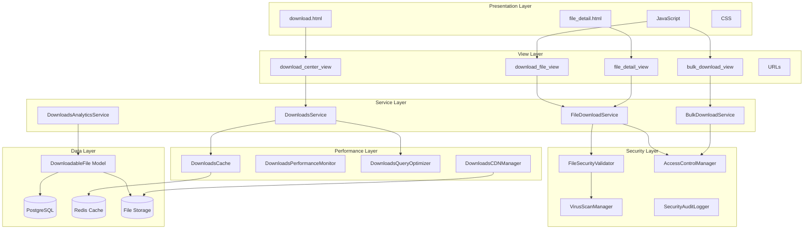

---

## 🔄 Data Flow Diagrams

### File Download Flow

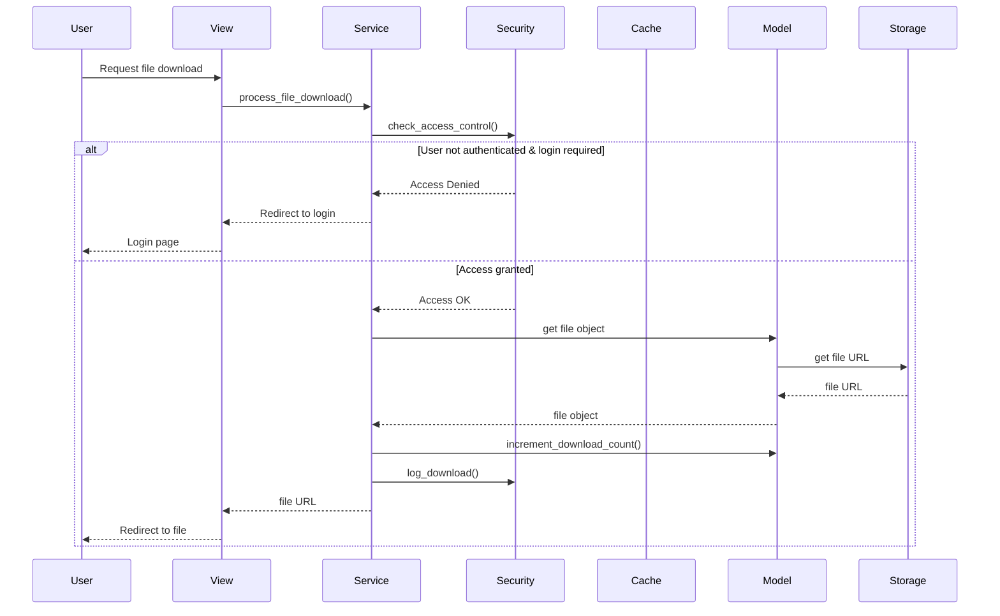

### File Upload Flow (Admin)

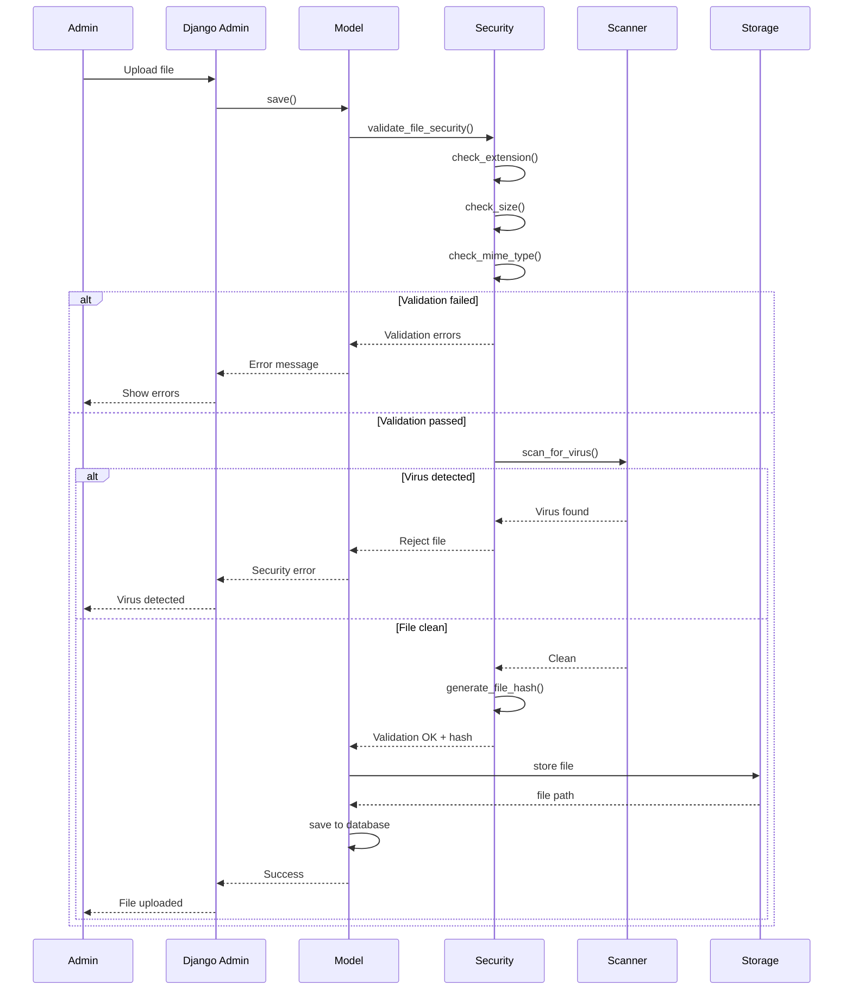

### Download Center Page Load Flow

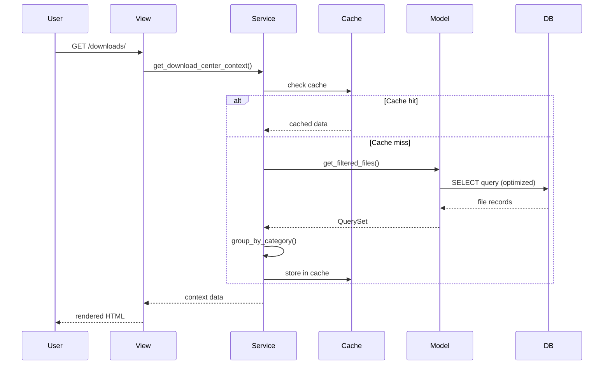

---

## 🗂️ File Organization

```
apps/downloads/
├── __init__.py
├── admin.py              # Django admin configuration
├── apps.py               # App configuration
├── models.py             # Data models (DownloadableFile)
├── views.py              # View functions
├── urls.py               # URL routing
├── forms.py              # Forms (if any)
│
├── services.py           # Business logic services
├── security.py           # Security features
├── performance.py        # Performance optimizations
├── utils/                # Utility functions
│   ├── __init__.py
│   └── helpers.py
│
├── management/           # Management commands
│   └── commands/
│       ├── cleanup_expired_files.py
│       └── generate_download_stats.py
│
├── migrations/           # Database migrations
├── tests/                # Test suite
│   ├── test_models.py
│   ├── test_views.py
│   ├── test_services.py
│   ├── test_security.py
│   └── test_performance.py
│
├── static/downloads/     # Static files
│   ├── css/
│   │   └── downloads.css
│   └── js/
│       └── downloads.js
│
├── templates/downloads/  # Templates
│   ├── download.html
│   ├── file_detail.html
│   └── partials/
│       ├── file_card.html
│       └── category_section.html
│
└── README.md             # This file
```

---

## 🔐 Security Architecture

### Security Layers

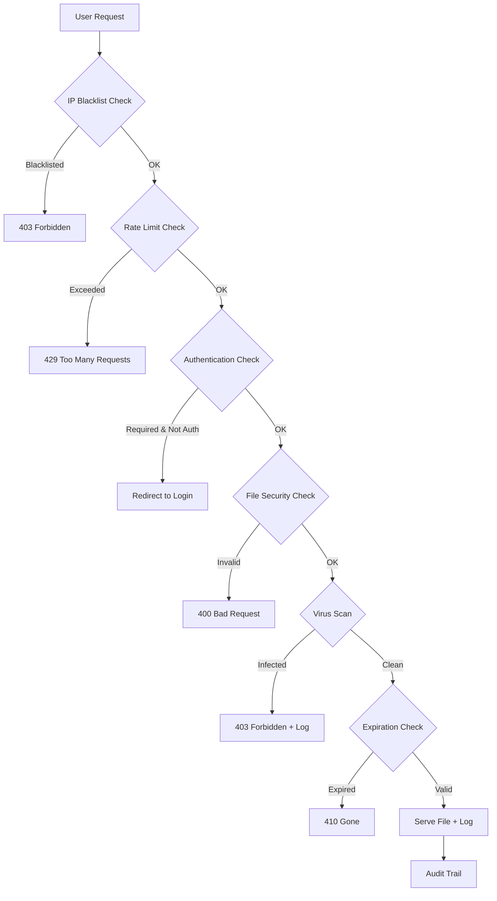

### Security Components

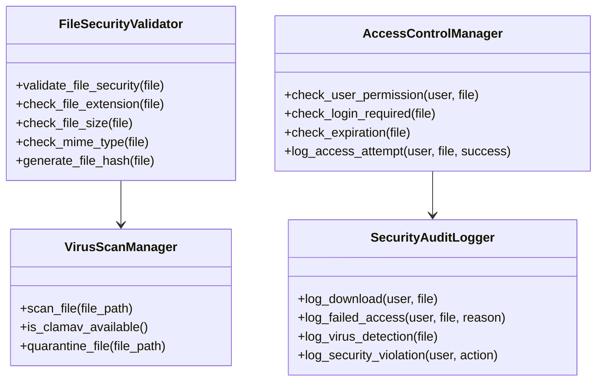

---

## ⚡ Performance Architecture

### Caching Strategy

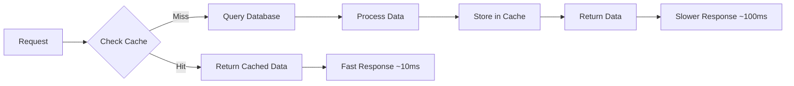

### Cache Layers

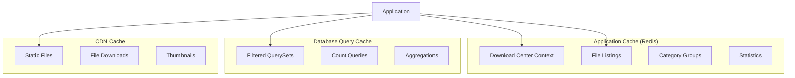

### Query Optimization

**Optimized Query Example:**

```python
# ❌ Bad (N+1 queries)
files = DownloadableFile.objects.filter(is_active=True)
for file in files:
    print(file.uploaded_by.username)  # Extra query each time!

# ✅ Good (1 query)
files = DownloadableFile.objects.filter(
    is_active=True
).select_related('uploaded_by')  # Join in single query
for file in files:
    print(file.uploaded_by.username)  # No extra query!
```

---

## 📊 Database Schema

### DownloadableFile Table

```sql
CREATE TABLE downloads_downloadablefile (
    id BIGSERIAL PRIMARY KEY,
    category VARCHAR(4) NOT NULL,
    title VARCHAR(200) NOT NULL,
    description TEXT,
    file VARCHAR(100) NOT NULL,
    is_active BOOLEAN NOT NULL DEFAULT TRUE,
    is_featured BOOLEAN NOT NULL DEFAULT FALSE,
    priority VARCHAR(4) NOT NULL,
    requires_login BOOLEAN NOT NULL DEFAULT FALSE,
    expires_at TIMESTAMP WITH TIME ZONE,
    tags VARCHAR(500),
    thumbnail VARCHAR(100),
    download_count INTEGER NOT NULL DEFAULT 0,
    view_count INTEGER NOT NULL DEFAULT 0,
    uploaded_at TIMESTAMP WITH TIME ZONE NOT NULL,
    updated_at TIMESTAMP WITH TIME ZONE NOT NULL,
    file_hash VARCHAR(64),
    uploaded_by_id BIGINT REFERENCES auth_user(id),
    last_accessed TIMESTAMP WITH TIME ZONE,
    access_count INTEGER NOT NULL DEFAULT 0,
    file_type VARCHAR(10)
);

-- Indexes
CREATE INDEX downloads_d_categor_0ca7e6_idx 
    ON downloads_downloadablefile (category, is_active);

CREATE INDEX downloads_d_priorit_4e95c0_idx 
    ON downloads_downloadablefile (priority, is_featured);

CREATE INDEX downloads_d_uploade_f68532_idx 
    ON downloads_downloadablefile (uploaded_at);
```

---

## 🔌 Integration Points

### External Services

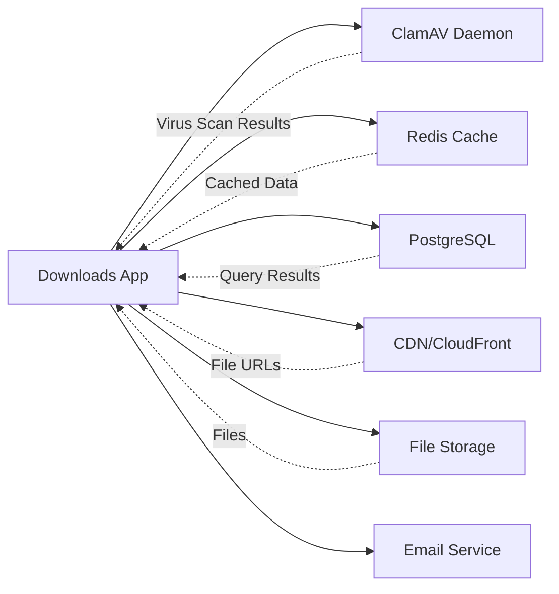

### Internal Dependencies

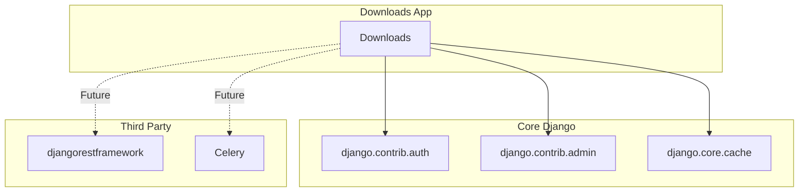

---

## 🚀 Deployment Architecture

### Production Setup

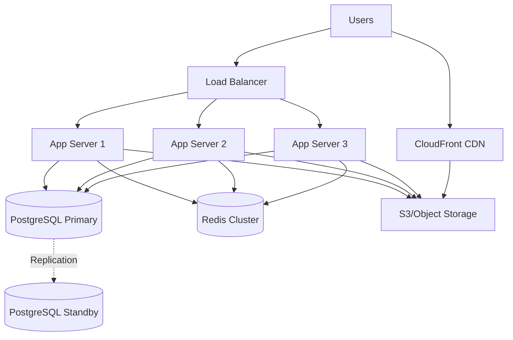

---

## 📈 Scalability Considerations

### Current Capacity
- **Files:** Up to 10,000 files
- **Concurrent Downloads:** ~100 req/sec
- **Storage:** Unlimited (cloud storage)

### Scalability Strategies
1. **Horizontal Scaling:** Add more app servers
2. **Caching:** Redis cluster for high availability
3. **CDN:** Offload file delivery
4. **Database:** Read replicas for queries
5. **Background Jobs:** Celery for async tasks

---

## 🔄 Future Enhancements

### Planned Architecture Changes

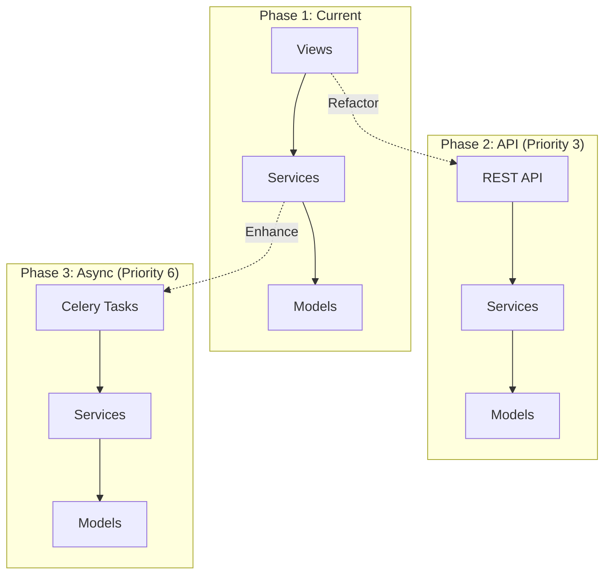

---

## 📚 References

- [Django Best Practices](https://docs.djangoproject.com/en/stable/misc/design-philosophies/)
- [Service Layer Pattern](https://martinfowler.com/eaaCatalog/serviceLayer.html)
- [Clean Architecture](https://blog.cleancoder.com/uncle-bob/2012/08/13/the-clean-architecture.html)

---

**Maintained By:** Bhanjyang Dev Team  
**Last Review:** January 6, 2026  
**Next Review:** March 2026
